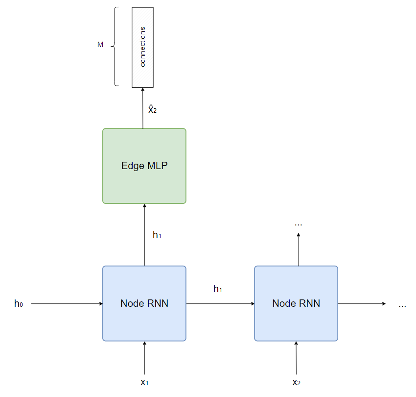
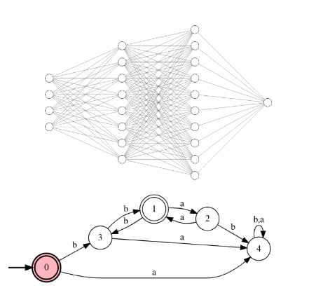

# Bachelor in Software Engineering

## About Me

I am a Computer Engineering student at Universidad ORT, currently in the final stages of completing my thesis titled "Analysis, Evaluation and Improvement of Active Regular Inference Algorithms for Neural Sequence Acceptors". Simultaneously, I hold the position of an Artificial Intelligence lecturer at the same university. With a keen interest in AI and Machine Learning, my goal is to apply my skills and knowledge to create innovative and impactful solutions for real-world problems. I consider myself hardworking and maintain a spirit of daily self-improvement, striving to enhance my capabilities consistently.

## Education

- B.S., Computer Engineering student | Universidad ORT Uruguay 
- B.S., Software Engineering | Universidad ORT Uruguay (_Mar 2023_)

## Work Experience

**Lecturer @ Universidad ORT Uruguay (_Aug 2021 - Present_)**

- Lead weekly Artificial Intelligence practical courses utilizing Python to teach practical lessons on subjects like Q-learning and Minimax.
- Instructed students in Data Structures and Algorithms courses, covering both theoretical analysis and C++ programming.
- Delivered courses in Haskell for Logic and Discrete Mathematics.

**Backend Developer @ SHOWX (_May 2023 - Feb 2024_)**

- Leading the gradual migration of data from a NoSQL database to a SQL database.
- Responsible for designing the database tables, developing functionalities, and deploying them.
- Technologies used include Golang, JavaScript, PostgreSQL, PostGIS, Firebase, and Google Cloud.

## Projects

### GraphRNNAutomaton

Utilized a GraphRNN architecture to generate Deterministic Finite Automata (DFA) with specific properties.

### RAG Chatbot

The RAG Chatbot is an application that utilizes the RAG (Retrieval-Augmented Generation) architecture to provide responses to user queries. The RAG architecture enhances the capabilities of large language models (LLMs) by augmenting their knowledge with additional contextual data. This chatbot is implemented using FastAPI, a modern web framework for building APIs with Python. It leverages the LangChain library, which provides tools and utilities for natural language processing tasks. Specifically, it uses LangChain's Runnable interfaces to orchestrate the RAG architecture.

### Neural Checker

Its main goal is to provide implementations for the structures needed for working in the Model Extraction Framework and enable the explainability and checking of complex systems in a black box context. It is developed by the Artificial Intelligence and Big Data team of Universidad ORT Uruguay.

## Publications

1. Franz Mayr, Sergio Yovine, Matías Carrasco, Alejo Garat, Martín Iturbide, Juan da Silva, and Federico Vilensky. "Results of Neural-Checker Toolbox in Taysir 2023 Competition," in Proceedings of 16th edition of the International Conference on Grammatical Inference, eds. François Coste, Faissal Ouardi, and Guillaume Rabusseau, vol. 217, pp. 295-298, PMLR, Jul 10-13, 2023. https://proceedings.mlr.press/v217/mayr23b.html. 
